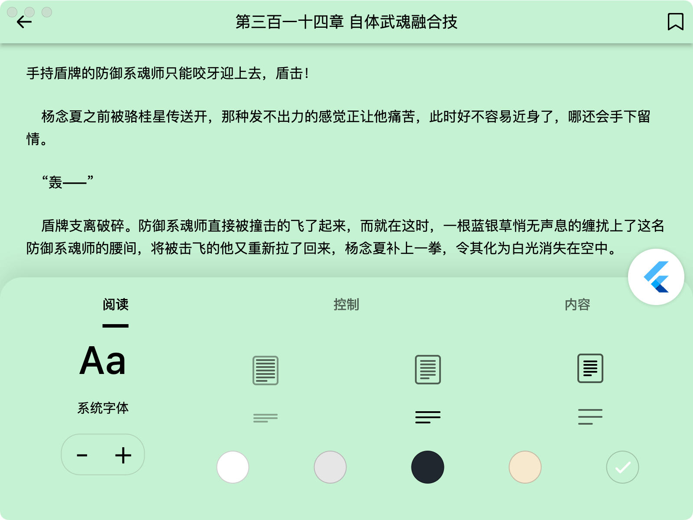
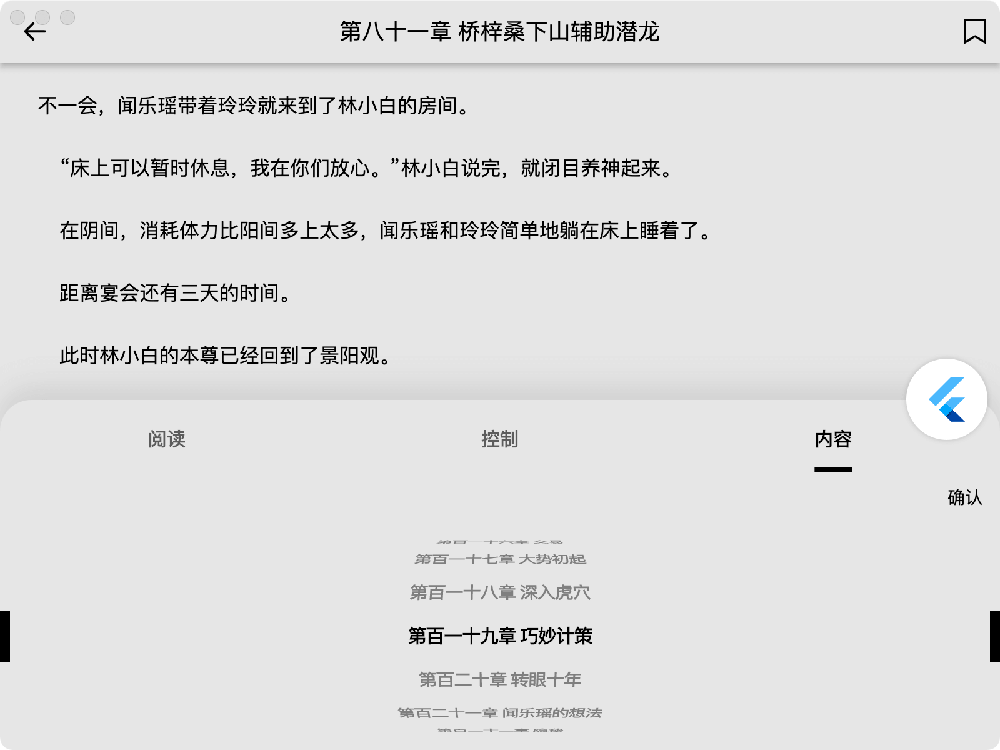
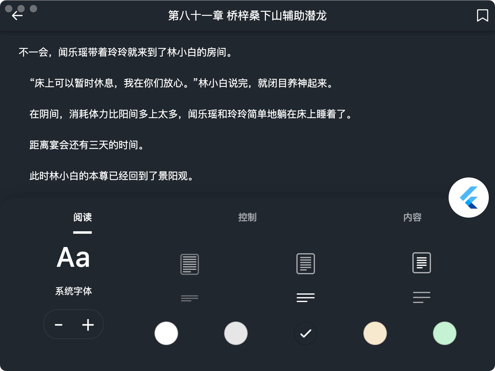
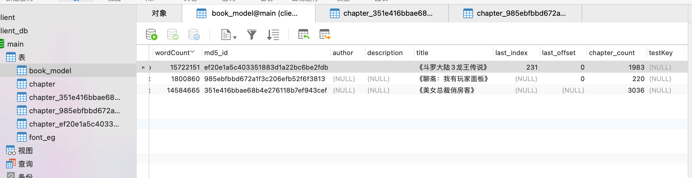
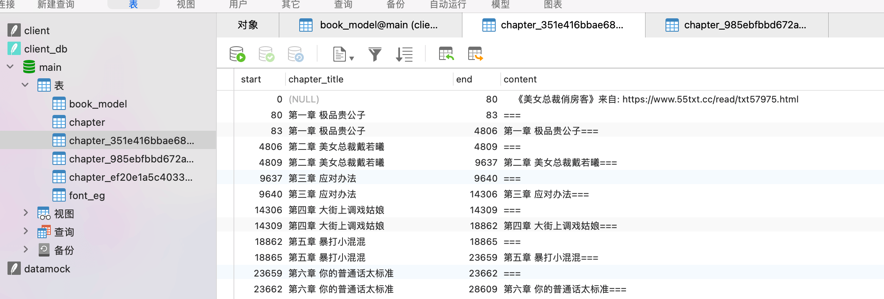
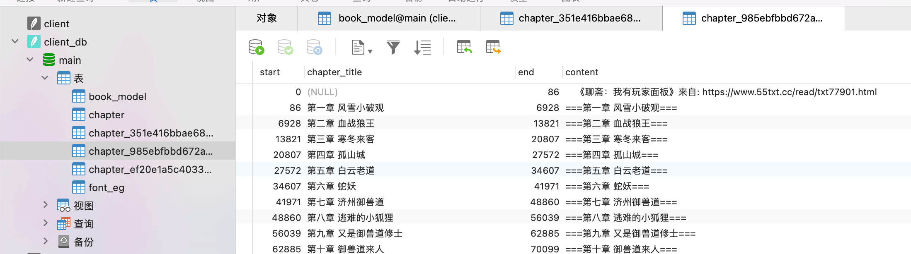
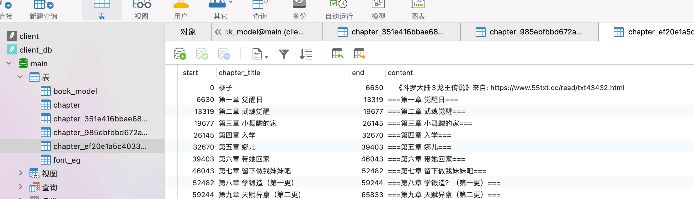
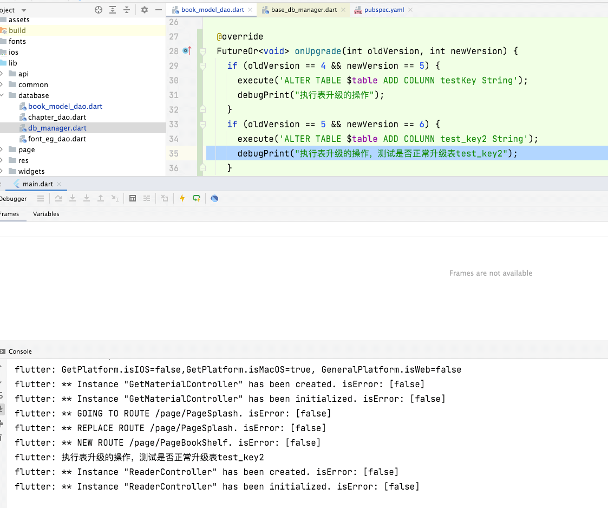
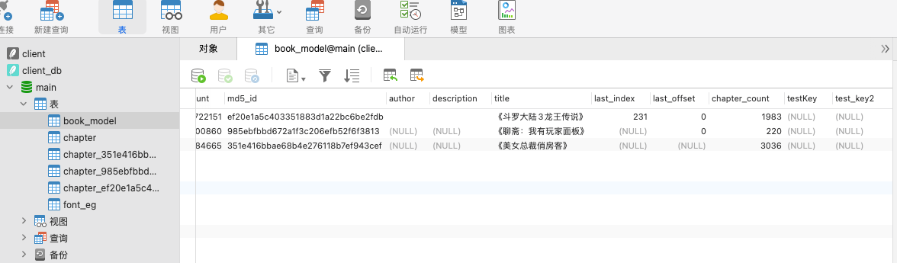

# book_reader

已经实现了如下功能，感觉可以满足正常的阅读需求

- 添加一本小说到数据库中，一本小说用一个表进行保存,（这里测试了json2dart_db的多表功能）
- 注意小说内容也保存到数据库中了，所以数据库db的大小会很大，目前测试了几次，超过120MB，数据库就有点难写入表中，写入一条数据，会阻塞很长时间（可以考虑每次都从文件中读取，章节已记录了该章节在文件中的起始位置,使用read(
  start,end)就能动态从文件中读取章节了）
- 实测过30M大小的小说进行章节解析，都能够正常解析成功
- 支持多种阅读主题
- 支持章节跳转
- 支持记住最后阅读的一章，但不支持记住上次阅读的具体位置
- 支持更换字体，以及动态导入字体
- 支持调整阅读字体的大小

# 截图预览

## 首页

## 绿色护眼

## 亮色

## 水墨效果

## 夜晚主题

## 旧纸张

# json2dart_db 数据库测试

## book_model

## chapter.*? 多表测试

## 更新表结构

