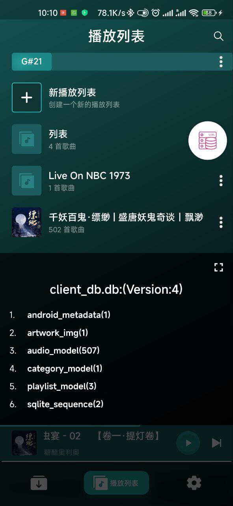
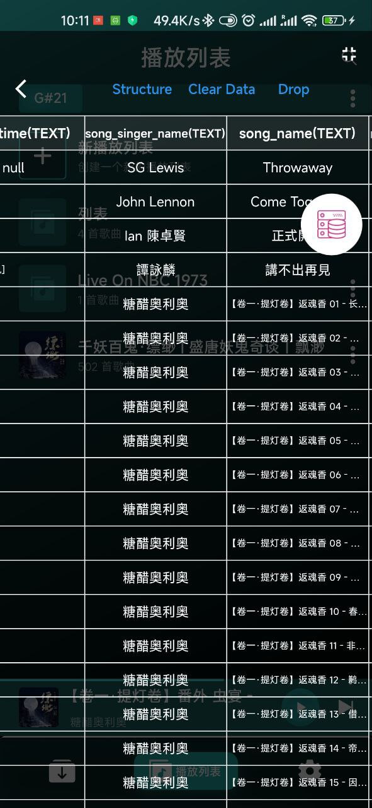
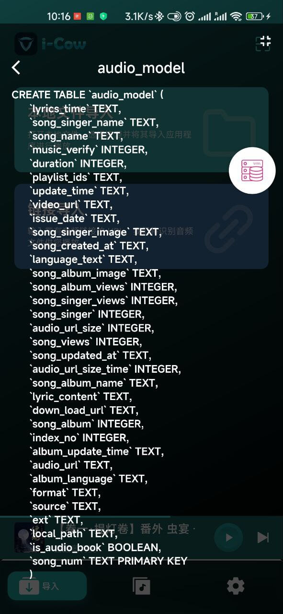

# json2dart_viewer

结合json2dart(安全转换的插件)，跟json2dart_db(数据库的插件)两个组件，可以查询当前数据库所有的数据表跟数据表内容，数据表结构等，可以满足日常开发的需要

## 1.显示数据库所有的表



## 2.点击选中后某个表的内容



## 3.点击Structure，显示数据的表结构



# 接入插件
## 2.代码接入
是根据Ume插件规范开发的插件，使用方式跟这其一样，大家可以参考字节跳动的原项目[flutter_ume](https://pub.dev/packages/flutter_ume)
```dart
import 'package:json2dart_viewer/json2dart_viewer.dart';
PluginManager.instance
          ..register(const DBViewer())
          ..register(const MonitorPlugin())
          ..register(const MonitorActionsPlugin())
          ..register(const WidgetDetailInspector())
          ..register(const ColorSucker())
          ..register(AlignRuler())
          ..register(const ColorPicker()) // 新插件
          ..register(const TouchIndicator()) // 新插件
          ..register(Performance())
          ..register(const ShowCode())
          ..register(const MemoryInfoPage())
          ..register(CpuInfoPage())
          ..register(const DeviceInfoPanel())
          ..register(Console())
          ..register(DioInspector(dio: HttpManager.instance.getDio()));
```